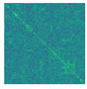
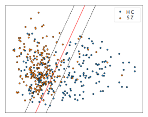

# SZML - Support Vector Machines for Automatic Diagnosis of Patients with Schizophrenia

Implementation for training support vector machines and evaluate its automatic classification performance.


## Data

#### Brain-wise functional connectivity matrix (FC) 

We choose the automated anatomical labeling version 3 ([AAL3](https://www.sciencedirect.com/science/article/pii/S1053811919307803)) to calculate brain-wise FC, and we only use the lower triangle elements of the FC matrix ( 166 x 166 ).

Data shape : ( N, 13695 ).

In this repo, you can find fake AAL-3 FC data (generated by Generative Adversarial Network) for SZ/HC to verify the code.




## Model

**Support Vector Machine** ([SVM](https://scikit-learn.org/stable/modules/generated/sklearn.svm.SVC.html)) is a supervised learning model with an associated learning algorithm that analyzes data for classification. We use **nested 10-fold cross-validation** to evaluate SVMs with inner cross-validation for hyperparameter determination and outer cross-validation for performance evaluations.




## Getting Started

###### Clone the repo

```
git clone https://github.com/NCUEE-NLPLab/SZML
cd SZML
```


### Development Environment

###### Install required python libraries

```
pip install -r requirements.txt
```

* python=3.7.10

* scikit-learn=0.24.2
* nilearn=0.8.0
* pandas=1.3.1
* numpy=1.20.3
* scipy=1.7.0
* tqdm=4.61.2


### Run

```
python main.py --model=SVC --times=2
```

| Argument    | Type | Default              | Description                                      |
| :---------- | :--- | :------------------- | :----------------------------------------------- |
| hcdata_path | str  | data/fake_hcdata.npy | HC data path                                     |
| szdata_path | str  | data/fake_szdata.npy | SZ data path                                     |
| result_path | str  | result               | Output folder                                    |
| log         | str  | train_log            | Logger name                                      |
| model       | str  | SVC                  | Select scikit-learn model. ("SVC", "linear_svc") |
| times       | int  | 2                    | Repeat times for classification.                 |
| C           | list | [1,10,100,1000]      | Regularization parameter.                        |
| tol         | list | [0.001,0.01,0.1,1]   | Tolerance for stopping criterion.                |
| n_jobs      | int  | 2                    | Number of jobs to run in parallel.               |


```
>python main.py --model=SVC --times=2

|INFO]:Load data
|INFO]:tuned_parameters:[{'C': [1, 10, 100, 1000], 'tol': [0.001, 0.01, 0.1, 1]}]
|INFO]:training seed:[0, 1]
|INFO]:model:SVC(class_weight='balanced', kernel='linear', max_iter=1000, random_state=42)
|INFO]:shuffle_seed:0
|INFO]:num_split:0
|INFO]:traindata_shape:(396, 13695)
|INFO]:testdata_shape:(44, 13695)
|INFO]:cv_results
|INFO]:{'C': 10, 'tol': 0.001}
|INFO]:|accuracy:0.8484|f1_score:0.8512|sensitivity:0.8687|specificity:0.8282|
|INFO]:test_results
|INFO]:|accuracy:0.7727|f1_score:0.7727|sensitivity:0.7727|specificity:0.7727|auc_score:0.8368|
...
...
|INFO]:finish
```


## Results

###### Evaluation metrics

* Accuracy

* F1-score

* Sensitivity

* Specificity

* AUC

  

###### Output files

5 files and the result of random seeds 

* result.csv : All the Evaluation metrics for all random seeds.

| Seed    | train_accuracy | test_accuracy | train_f1_score | test_f1_score | train_sensitivity | test_sensitivity | train_specificity | test_specificity | test_auc_score |
| ------- | -------------- | ------------- | -------------- | ------------- | ----------------- | ---------------- | ----------------- | ---------------- | -------------- |
| 0       | 0.8256         | 0.8523        | 0.8321         | 0.8553        | 0.8640            | 0.8773           | 0.7872            | 0.8273           | 0.9252         |
| 1       | 0.8253         | 0.8545        | 0.8307         | 0.8553        | 0.8569            | 0.8773           | 0.7936            | 0.8318           | 0.9236         |
| ...     | ...            | ...           | ...            | ...           | ...               | ...              | ...               | ...              | ...            |
| 99      | 0.8273         | 0.8591        | 0.8334         | 0.8627        | 0.8645            | 0.8727           | 0.7901            | 0.8455           | 0.9188         |
| Average | 0.8269         | 0.8505        | 0.8325         | 0.8537        | 0.8596            | 0.8732           | 0.8505            | 0.8278           | 0.9228         |
| Std     | 0.0020         | 0.0084        | 0.0018         | 0.0079        | 0.0035            | 0.0100           | 0.0050            | 0.014            | 0.0048         |


* cm.csv : Confusion Matrix result.

  |      | TP    | FP   | TN    | FN   | Count |
  | ---- | ----- | ---- | ----- | ---- | ----- |
  | cm   | 19210 | 3789 | 18211 | 2790 | 100   |

* rank.csv : Ranking the feature importance.

  | index | rankscore | rank  |
  | ----- | --------- | ----- |
  | 0     | 3380014   | 2768  |
  | ...   | ...       | ...   |
  | 13694 | 11038961  | 11593 |

* rank200.csv : same to rank.csv , but only top 200.

* trainlog.log :  Tracking events that happen when the process runs.

* XX_cvresult.csv : the result of  inner CV.

* XX_testresult.csv : the result of outer CV.


## Reference

Scikit-learn https://scikit-learn.org/

Nilearn https://nilearn.github.io/

Chang C-C, Lin C-J. [LIBSVM: A Library for Support Vector Machines](http://www.csie.ntu.edu.tw/~cjlin/papers/libsvm.pdf). ACM Trans Intell Syst Technol. 2011;2(3):Article 27.
